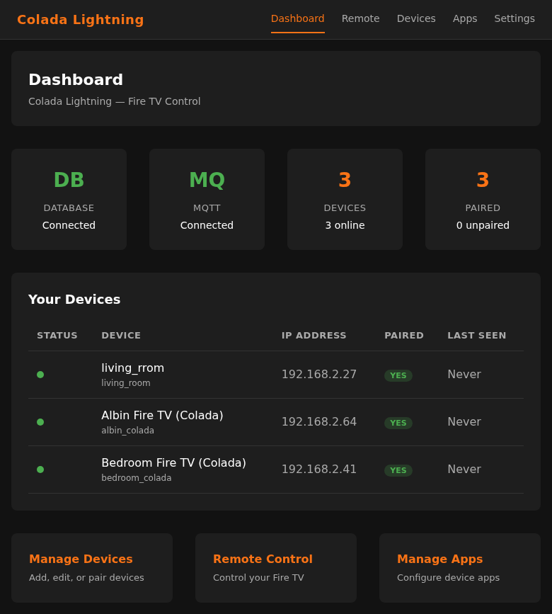
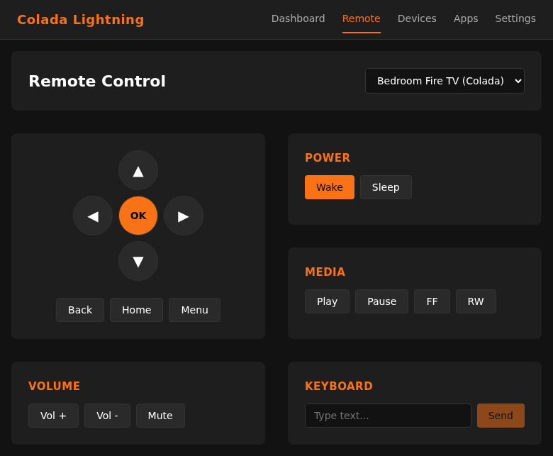
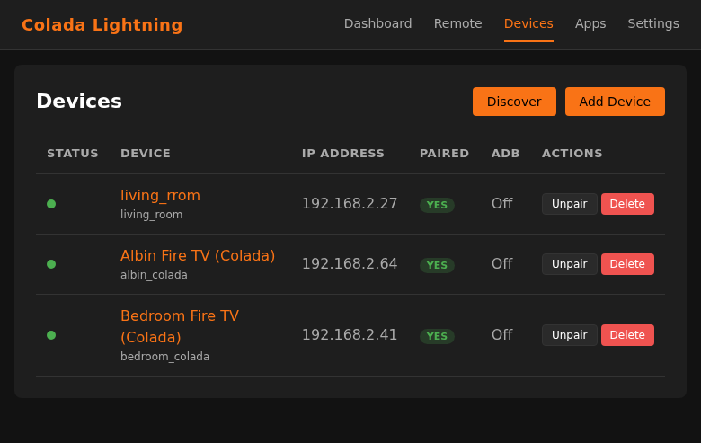

# HMS FireTV - Fire TV Lightning Protocol Service

[](LICENSE)
[](https://github.com/hms-homelab/hms-firetv/pkgs/container/hms-firetv)
[](https://www.buymeacoffee.com/aamat09)
[](https://github.com/hms-homelab/hms-firetv/actions)

C++ Fire TV control service with Angular web UI and Home Assistant MQTT integration. 2.2 MB memory.

## Screenshots







## Features

- Fire TV Lightning protocol (HTTPS port 8080, DIAL port 8009)
- 15 Home Assistant button entities per device via MQTT Discovery
- Angular web UI (dashboard, remote control, device/app management)
- Automatic IP discovery when Fire TVs change DHCP addresses
- Device pairing with PIN verification
- SQLite by default, PostgreSQL optional
- MQTT optional — service starts and runs without a broker
- 2.2 MB memory footprint

## Quick Start

### 1. Build

```bash
# Dependencies (Debian/Ubuntu)
sudo apt install build-essential cmake libsqlite3-dev \
    libpaho-mqttpp-dev libcurl4-openssl-dev libjsoncpp-dev

# Build C++ + Angular frontend
mkdir build && cd build
cmake -DCMAKE_BUILD_TYPE=Release ..
make -j$(nproc)

# Build frontend (requires Node 22+)
cd frontend && npm ci && npx ng build --configuration production
cp -r dist/frontend/browser/* ../static/
```

> PostgreSQL support is optional. Add `-DBUILD_WITH_POSTGRESQL=ON` to cmake and install `libpqxx-dev` if needed.

### 2. Configure

```bash
# Minimal — SQLite, no MQTT required
export API_PORT=8888

# Optional: use PostgreSQL instead of SQLite
export DB_TYPE=postgresql
export DB_HOST=localhost DB_PORT=5432 DB_NAME=firetv
export DB_USER=firetv_user DB_PASSWORD=your_password

# Optional: MQTT for Home Assistant integration
export MQTT_BROKER_HOST=localhost MQTT_BROKER_PORT=1883
export MQTT_USER=your_user MQTT_PASS=your_pass

# Optional: IP discovery
export DISCOVERY_SUBNET=192.168.2    # scan this /24 subnet
export DISCOVERY_INTERVAL=300        # every 5 minutes
```

### 3. Run

```bash
./hms_firetv
```

The service starts immediately. MQTT connects in the background — if the broker is unavailable at startup, it retries automatically without blocking the API.

### 4. Build and Deploy (all-in-one)

```bash
./build_and_deploy.sh
```

Environment variables for the deploy script:
- `HMS_FIRETV_INSTALL_PATH` (default: `/usr/local/bin/hms_firetv`)
- `HMS_FIRETV_SERVICE` (default: `hms-firetv`)

## Docker

```bash
docker pull ghcr.io/hms-homelab/hms-firetv:latest
docker run -p 8888:8888 ghcr.io/hms-homelab/hms-firetv:latest

# With PostgreSQL and MQTT
docker run --env-file .env -p 8888:8888 ghcr.io/hms-homelab/hms-firetv:latest

# Or with docker-compose
docker compose up -d
```

Supports `linux/amd64` and `linux/arm64`.

## Architecture

```
Angular Web UI (port 8888)
    |
Drogon HTTP + REST API
    ├── DeviceController    (CRUD)
    ├── PairingController   (pair/verify/reset)
    ├── CommandController    (nav/media/volume)
    ├── AppsController      (launch/manage)
    └── StatsController     (usage stats)
    |
    ├── DiscoveryService    (subnet scan, token match, IP update)
    ├── LightningClient     (HTTPS + CURL)
    ├── MQTTClient          (Eclipse Paho, auto-reconnect, optional)
    ├── DiscoveryPublisher  (HA MQTT Discovery, 15 buttons/device)
    └── IDatabase           (SQLite default / PostgreSQL optional)
```

## Web UI

The Angular frontend provides:

- **Dashboard** -- DB/MQTT status, device overview, quick actions
- **Remote** -- D-pad, media controls, volume, power, keyboard input, favorite app quick-launch
- **Devices** -- Add/edit/delete devices, pairing with PIN, subnet discovery
- **Apps** -- Manage installed apps per device, launch with one click
- **Settings** -- Service status and health

## MQTT Topics

```
maestro_hub/colada/{device_id}/{action}        # command input
homeassistant/button/colada/{id}_{btn}/config  # HA discovery
colada/{device_id}/availability                # online/offline
```

## License

MIT License -- see [LICENSE](LICENSE) for details.
