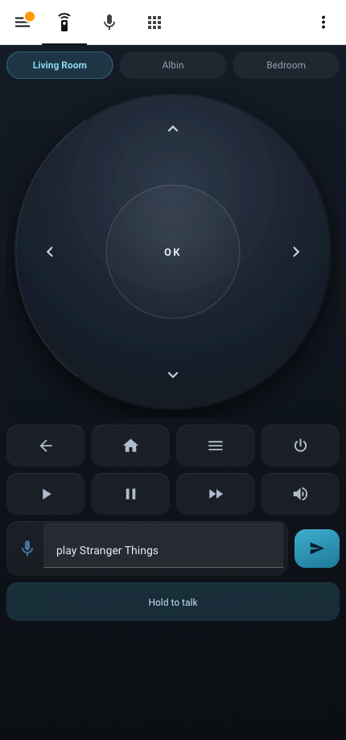
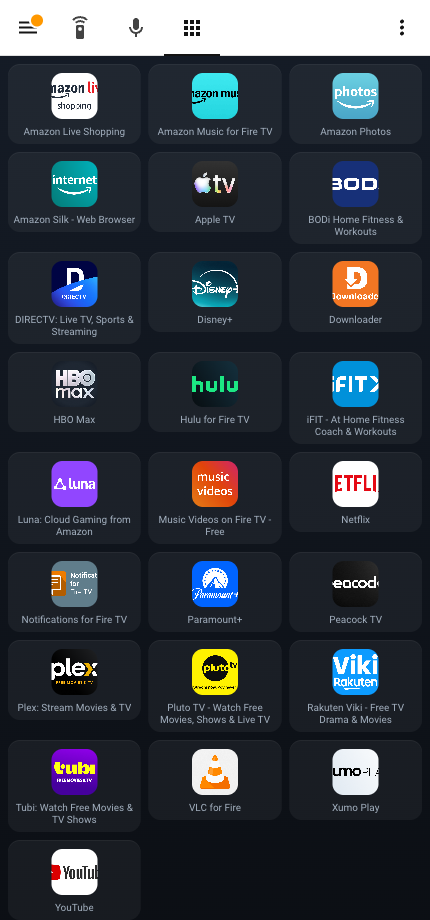
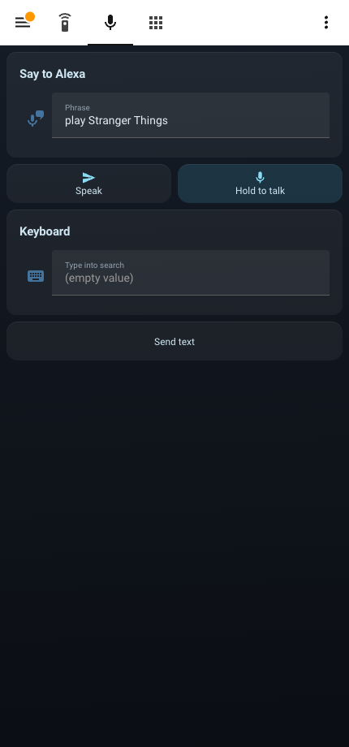
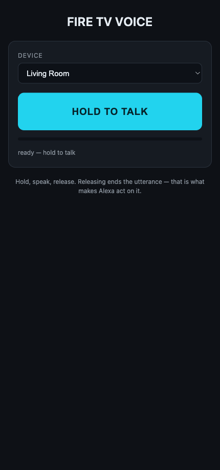
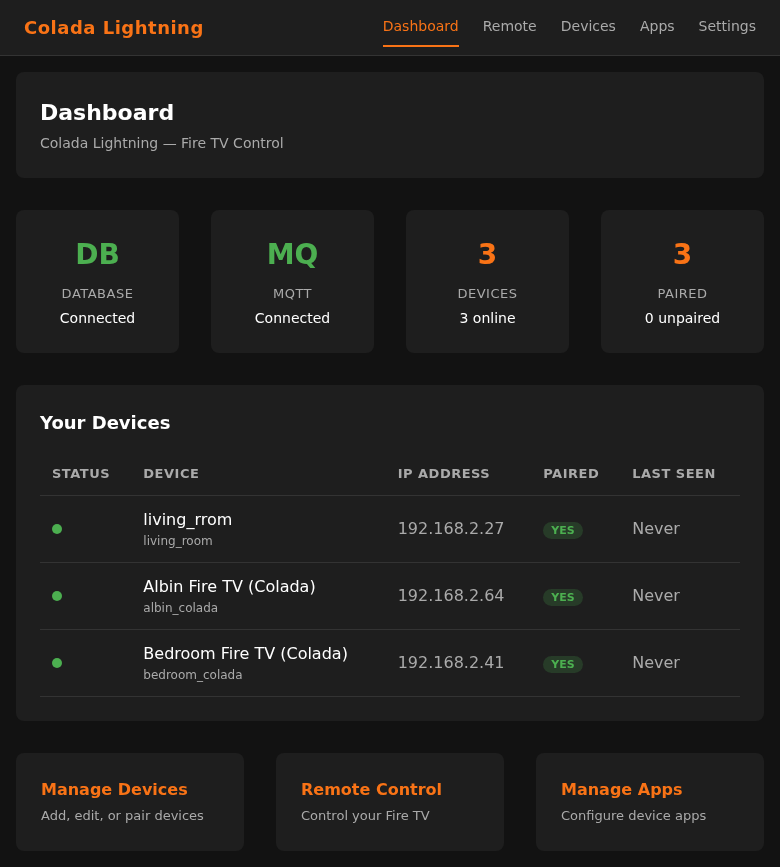
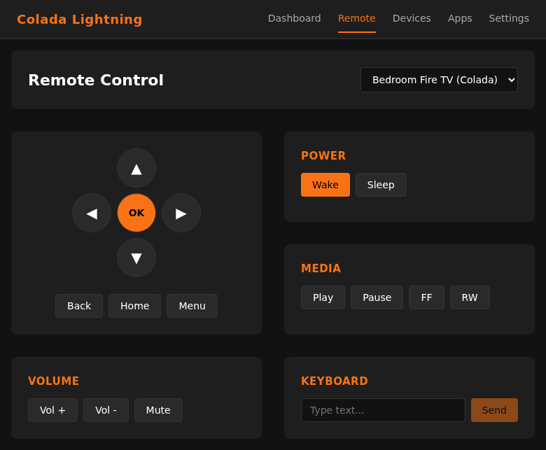
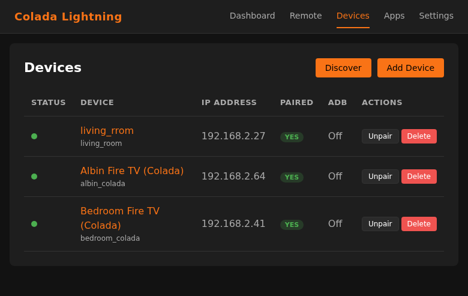

# HMS FireTV - Fire TV Lightning Protocol Service

[](LICENSE)
[](https://github.com/hms-homelab/hms-firetv/pkgs/container/hms-firetv)
[](https://www.buymeacoffee.com/aamat09)
[](https://github.com/hms-homelab/hms-firetv/actions)

Multi-device Fire TV control service with event-driven Home Assistant MQTT Discovery integration and Angular web UI. Register as many Fire TVs as you want — each one appears automatically as a set of button entities in HA. 2.2 MB memory.

Beyond the documented Lightning endpoints it also drives **Alexa by voice**, **press-and-hold** key repeat, and the device's **real installed app list** — see [Fire TV protocol](#fire-tv-protocol) for how those were found.

## Screenshots

### Home Assistant remote

A dashboard built on this service's REST API, in `homeassistant/`. The pad is
one machined disc; a tap steps once and a **hold repeats**, which is the
keyDown/keyUp pair the official app uses. Devices are chips, and the phrase
box speaks to Alexa.



The app grid is generated from the device's **own installed list**, so it
cannot go stale, and the voice view holds the phrase box, the live microphone
and the keyboard.




### Live microphone

Push to talk from a browser or the Home Assistant companion app. Audio is
captured, downsampled and relayed straight into the Fire TV's own voice
channel.



> Browsers only expose a microphone to a **secure context**, so this page has
> to be served over `https://` — set `API_SSL_PORT`. An `https` page embedded
> in an `http` one does not qualify either; every ancestor must be secure.

### Angular web UI







## Features

- Multi-device — register unlimited Fire TVs, all managed from one service
- Event-driven HA integration — each device auto-publishes 24 button entities, an app picker and a voice box via MQTT Discovery, no manual HA config needed
- Fire TV Lightning protocol (HTTPS port 8080, DIAL port 8009)
- **Alexa voice** — speak text through a TTS engine, play an audio file, or relay a live microphone (WebSocket port 9090)
- **Press and hold** — keyDown/keyUp pairs, so one press scrolls a list instead of stepping one row
- **Real installed app list** read from the device, with its own icons
- Angular web UI (dashboard, remote control, device/app management)
- Automatic IP discovery when Fire TVs change DHCP addresses
- Device pairing with PIN verification
- SQLite by default, PostgreSQL optional
- MQTT optional — service starts immediately, connects to broker in the background
- 2.2 MB memory footprint

## Quick Start

### 1. Build

```bash
# Dependencies (Debian/Ubuntu)
sudo apt install build-essential cmake libsqlite3-dev \
    libpaho-mqttpp-dev libcurl4-openssl-dev libjsoncpp-dev

# Build C++ + Angular frontend
mkdir build && cd build
cmake -DCMAKE_BUILD_TYPE=Release ..
make -j$(nproc)

# Build frontend (requires Node 22+)
cd frontend && npm ci && npx ng build --configuration production
cp -r dist/frontend/browser/* ../static/
```

> PostgreSQL support is optional. Add `-DBUILD_WITH_POSTGRESQL=ON` to cmake and install `libpqxx-dev` if needed.

### 2. Configure

```bash
# Minimal — SQLite, no MQTT required
export API_PORT=8888

# Optional: use PostgreSQL instead of SQLite
export DB_TYPE=postgresql
export DB_HOST=localhost DB_PORT=5432 DB_NAME=firetv
export DB_USER=firetv_user DB_PASSWORD=your_password

# Optional: MQTT for Home Assistant integration
export MQTT_BROKER_HOST=localhost MQTT_BROKER_PORT=1883
export MQTT_USER=your_user MQTT_PASS=your_pass

# Optional: IP discovery
export DISCOVERY_SUBNET=192.168.2    # scan this /24 subnet
export DISCOVERY_INTERVAL=300        # every 5 minutes

# Optional: speak to Alexa. The device voice channel carries audio and never
# text, so text is synthesised first. Any Wyoming engine works.
export TTS_HOST=192.168.2.5 TTS_PORT=10200
export TTS_VOICE=                    # empty uses the engine default

# Optional: TLS, required only for the live microphone page — a browser will
# not grant a microphone to a page served over plain http.
export API_SSL_PORT=8443
export API_SSL_CERT=/path/cert.pem API_SSL_KEY=/path/key.pem
```

Leave `TTS_HOST` unset and speaking text reports itself unavailable while every
other voice mode keeps working. Leave `API_SSL_PORT` unset and the service is
plain HTTP exactly as before.

### 3. Run

```bash
./hms_firetv
```

The service starts immediately. MQTT connects in the background — if the broker is unavailable at startup, it retries automatically without blocking the API.

### 4. Build and Deploy (all-in-one)

```bash
./build_and_deploy.sh
```

Environment variables for the deploy script:
- `HMS_FIRETV_INSTALL_PATH` (default: `/usr/local/bin/hms_firetv`)
- `HMS_FIRETV_SERVICE` (default: `hms-firetv`)

## Docker

```bash
docker pull ghcr.io/hms-homelab/hms-firetv:latest
docker run -p 8888:8888 ghcr.io/hms-homelab/hms-firetv:latest

# With PostgreSQL and MQTT
docker run --env-file .env -p 8888:8888 ghcr.io/hms-homelab/hms-firetv:latest

# Or with docker-compose
docker compose up -d
```

Supports `linux/amd64` and `linux/arm64`.

## Architecture

```
Angular Web UI (port 8888)
    |
Drogon HTTP + REST API
    ├── DeviceController    (CRUD)
    ├── PairingController   (pair/verify/reset)
    ├── CommandController    (nav/media/volume)
    ├── AppsController      (launch/manage)
    └── StatsController     (usage stats)
    |
    ├── DiscoveryService    (subnet scan, token match, IP update)
    ├── LightningClient     (HTTPS + CURL, wakes a sleeping device and retries)
    ├── VoiceClient         (WebSocket to :9090, raw PCM at 1x)
    ├── TtsClient           (Wyoming, text -> speech)
    ├── VoiceService        (bookends, spoken text/audio, live relay)
    ├── AppSyncService      (appsV2 -> stored app list)
    ├── MQTTClient          (Eclipse Paho, auto-reconnect, optional)
    ├── DiscoveryPublisher  (HA MQTT Discovery, 24 buttons + apps + voice)
    └── IDatabase           (SQLite default / PostgreSQL optional)
```

## Web UI

The Angular frontend provides:

- **Dashboard** -- DB/MQTT status, device overview, quick actions
- **Remote** -- D-pad, media controls, volume, power, keyboard input, favorite app quick-launch
- **Devices** -- Add/edit/delete devices, pairing with PIN, subnet discovery
- **Apps** -- Manage installed apps per device, launch with one click
- **Settings** -- Service status and health

## Fire TV protocol

The Lightning REST API on port 8080 is community-documented. Three things here
are not, and were recovered by reading the official Fire TV remote app
(`com.amazon.storm.lightning.client.aosp`) rather than by guessing at traffic:
**the app logs every request it makes, in clear.** Its networking layer is
`expo.modules.feniksnetworking`, which logs at tag `FeniksNetworkModule`, so

```bash
adb logcat | grep FeniksNetworkModule
```

while pressing buttons yields the method, URL and body of everything the real
remote does.

### Endpoints

Base `https://{ip}:8080`, self-signed, `X-Api-Key` + `X-Client-Token` headers.

| Call | Purpose |
|---|---|
| `POST /v1/FireTV?action=<a>` | `dpad_up/down/left/right`, `select`, `back`, `home`, `menu` |
| `POST /v1/media?action=<a>` | `play`, `scan` |
| `GET  /v1/FireTV/appsV2` | **the installed app list**, with display names and icon art |
| `POST /v1/FireTV/app/<package>` | launch an app |
| `POST /v1/FireTV/voiceCommand?action=start\|stop` | **bookends a voice stream** |
| `GET  /v1/FireTV/keyboard` | open the on-screen keyboard |
| `POST /v1/FireTV/pin/display`, `/pin/verify` | PIN pairing |
| `POST http://{ip}:8009/apps/FireTVRemote` | wake — plain HTTP, works while asleep |

### Press and hold

Navigation can be sent two ways. A single body-less POST is one discrete
press. The app also sends a **pair** — `{"keyActionType":"keyDown"}` then
`{"keyActionType":"keyUp"}` — and holding the key between them is what makes
the device repeat. That is the difference between a button that steps one row
and one that scrolls a list.

### Alexa voice, on port 9090

Voice is **not** part of the REST API. It is a second, separate channel:

```
POST https://{ip}:8080/v1/FireTV/voiceCommand?action=start
open  wss://{ip}:9090/                     <- HTTP/1.1 upgrade; h2 returns 400
send  raw audio as binary WebSocket frames
close the WebSocket                        <- this is end-of-utterance
POST https://{ip}:8080/v1/FireTV/voiceCommand?action=stop
```

The audio format came out of the app's own `VoiceSearch` class:
`RECORDING_RATE 16000`, `CHANNEL_IN_MONO`, `ENCODING_PCM_16BIT`. Its capture
loop reads straight from an `AudioRecord` into a byte array and hands each
buffer to `sendVoiceData()`, which writes it to the socket untouched.

> **The wire format is raw PCM: 16 kHz, mono, signed 16-bit little-endian.**
> No codec, no container, no length prefix, no framing of its own. One binary
> frame per buffer; the chunk size carries no meaning.

Two things are worth knowing before building on it:

- **The socket takes no authentication at all.** A plain HTTP/1.1 upgrade from
  an unpaired machine answers `101 Switching Protocols` — no token, no client
  certificate. Anything on the LAN can open it.
- **Stream at 1x.** The device believes it is hearing a live microphone. A five
  second clip pushed in one burst arrives in milliseconds and is not
  transcribed.

Since the channel carries audio and never text, saying something to Alexa means
synthesising it first. Point `TTS_HOST` at a [Wyoming](https://github.com/rhasspy/wyoming)
engine (wyoming-piper) and `POST /api/devices/{id}/voice/say` does the rest.

### Dead ends, so nobody re-chases them

- **Ports 55442/55443** (banner `WEHALEXA`) are Alexa **Whole Home Audio** —
  the LAN clustering behind speaker groups and stereo pairs, where one device
  receives a stream and re-broadcasts it to the others. Nothing to do with
  remote control.
- **8080 was never deprecated or moved.** It simply does not listen while the
  device is asleep, so scanning a sleeping Fire TV is misleading. Wake it on
  8009 first — this service now does that automatically and retries once.
- **9090 is not gRPC.** A gRPC-shaped POST returns a bare 404 with no
  `grpc-status` trailer.
- The app connects over **IPv4-mapped IPv6**, so parsing only `/proc/net/tcp`
  misses it; read `/proc/net/tcp6`.

## MQTT Topics

```
maestro_hub/colada/{device_id}/{action}        # command input
homeassistant/button/colada/{id}_{btn}/config  # HA discovery
colada/{device_id}/availability                # online/offline
```

Actions include `hold` (`"dpad_down,1200"`), `key_down` / `key_up`,
`launch_app`, `apps_refresh`, `voice_say`, `voice_start` / `voice_stop`.

## Voice API

```bash
# say something to Alexa (needs TTS_HOST)
curl -X POST localhost:8888/api/devices/lr/voice/say \
     -H 'Content-Type: application/json' -d '{"text":"play Stranger Things"}'

# speak a WAV, by URL or path, or as the request body
curl -X POST localhost:8888/api/devices/lr/voice/audio \
     -H 'Content-Type: application/json' -d '{"url":"http://.../clip.wav"}'

# hold a session open and push microphone audio into it
curl -X POST localhost:8888/api/devices/lr/voice/relay        # -> session_id
curl -X POST "localhost:8888/api/voice/relay/$SID/audio?raw=1" --data-binary @chunk.pcm
curl -X POST localhost:8888/api/voice/relay/$SID/close

# what the service thinks it can do
curl localhost:8888/api/voice/status
```

WAV is decoded natively (8/16/24/32-bit PCM and 32-bit float, any rate, mono or
stereo). Anything else needs `ffmpeg` on the host.

## License

MIT License -- see [LICENSE](LICENSE) for details.
